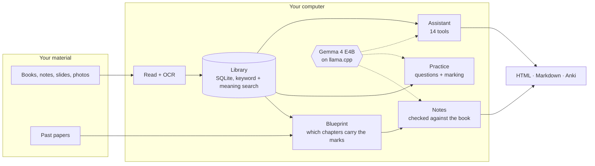
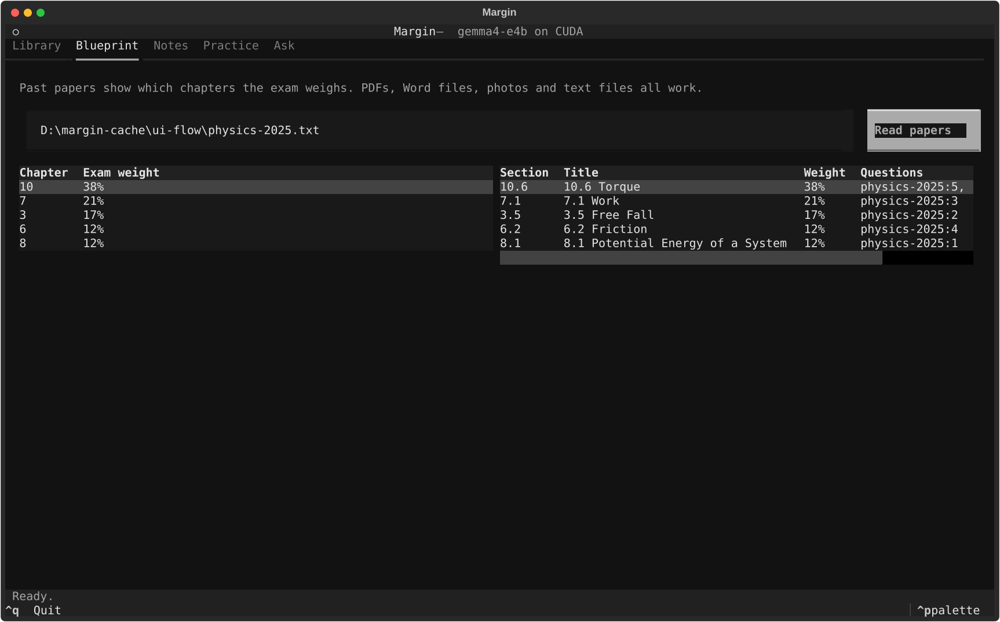
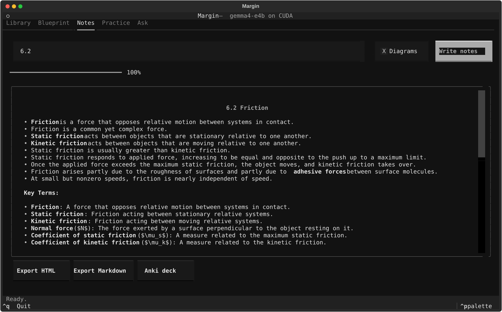
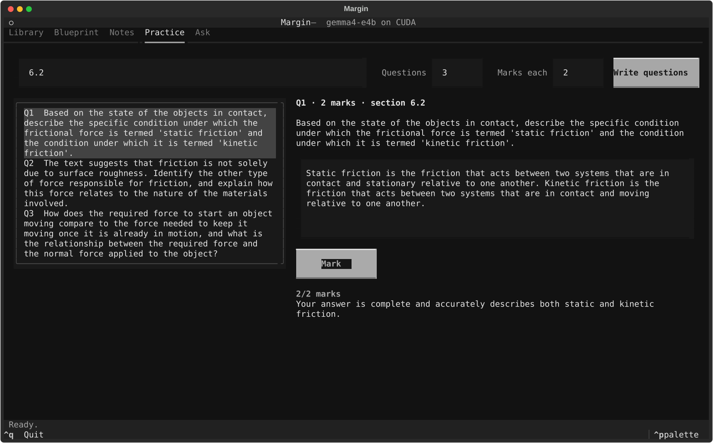
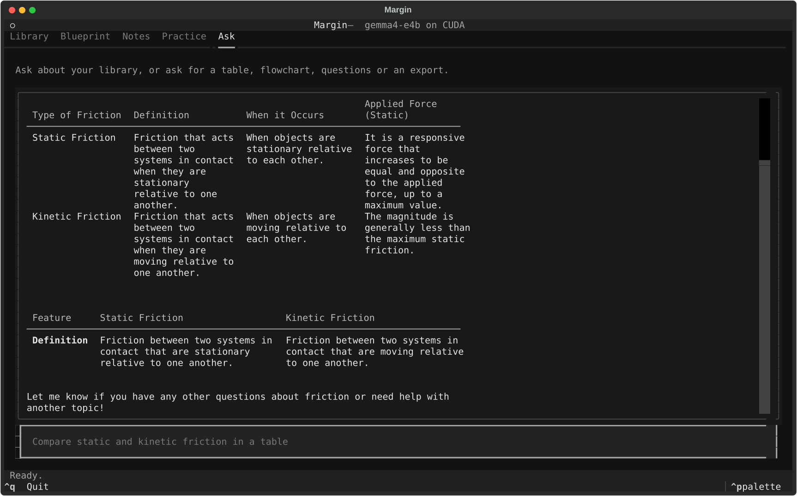

<div align="center">

# Margin

**Your textbook is huge. Your exam is not.**

An offline study assistant that reads your books and past papers, works out what the exam actually asks,<br>
and turns those parts into checked notes, diagrams and practice questions — on your own computer.

[](https://github.com/Kunsh162007/margin/actions/workflows/tests.yml)


[Quick start](#quick-start) · [What it does](#what-it-does) · [How it works](#how-it-works) · [Screenshots](#screenshots) · [Requirements](#requirements) · [Measured results](#measured-not-promised)

<br>


</div>

## Why Margin

Chat-with-your-PDF tools treat every page as equally important. A student has the
opposite problem: a thousand-page book, an exam that tests a fraction of it, and
not much time. Margin reads your past papers first, maps every question onto the
book, and spends its effort on the chapters that carry the marks.

Everything runs locally. Your books, notes and answers never leave your machine,
and there is no account, API key or subscription. It works with or without a
graphics card.

## Quick start

**Windows** (PowerShell)

```powershell
irm https://raw.githubusercontent.com/Kunsh162007/margin/main/scripts/install.ps1 | iex
```

**macOS and Linux**

```sh
curl -LsSf https://raw.githubusercontent.com/Kunsh162007/margin/main/scripts/install.sh | sh
```

Already use [uv](https://docs.astral.sh/uv/)? `uv tool install git+https://github.com/Kunsh162007/margin`

Then start it:

```sh
margin
```

The first run detects your hardware and downloads what suits it: the llama.cpp
runtime, the Gemma 4 E4B model (4.3 GB) and small search models. After that it
works with no internet connection. Set `MARGIN_HOME` to keep the downloads on
another drive.

## What it does

| | |
|---|---|
| **Reads messy material** | PDFs (typed or scanned), Word, PowerPoint and JPEG, PNG or WebP photos of pages and whiteboards, with OCR where there is no text. |
| **Finds what the exam wants** | Reads past papers — PDF, Word, photos or text — splits them into questions with marks and years, and ranks chapters by how much they are worth. |
| **Writes notes you can trust** | Every sentence is checked against the book, and anything the book does not support is removed. Each section is saved as it finishes, so you can stop and carry on later. |
| **Draws it out** | Flowcharts, comparison tables, mind maps, timelines, formula sheets and glossaries, repaired automatically so they always render. |
| **Sets and marks practice** | Questions must be answerable from the book, must not copy its exercises and must be worth the marks you asked for. Your answers are marked point by point, so you see exactly what was missing. |
| **Answers questions with tools** | An assistant with 14 tools that searches the book, reads sections, draws diagrams, does exact arithmetic, writes questions and exports your notes. |
| **Exports** | One-file HTML that works offline with the diagrams drawn (and prints to PDF), Markdown, and Anki decks with spaced-repetition scheduling. |

## How it works



A few decisions shape it:

- **The model only makes the judgements it is needed for.** Marks are counted in
  code from point-by-point decisions; question checks run in code; diagram and
  tool arguments are generated under a fixed format so they are valid by
  construction.
- **One small local model, chosen by measurement.** Nine open models were
  benchmarked on quality, speed and tool-calling accuracy on both CPU and GPU,
  with the selection rule fixed before the results were seen.
  [See the tables](evals/results/bench/tables.md).
- **No PyTorch.** Search and OCR use ONNX Runtime, which keeps the install small
  and fast on a CPU.
- **Offline is tested, not assumed.** The test suite blocks every connection that
  leaves the machine and fails if anything tries.

## Screenshots

From a real run with Gemma 4 E4B on the OpenStax *University Physics* textbook,
with the network switched off.

<table>
  <tr>
    <td width="50%"><b>Blueprint</b><br>A paper built from the textbook's own exercises, ranked by chapter.<br><br></td>
    <td width="50%"><b>Notes</b><br>Checked against the book, with a table the model chose to draw.<br><br></td>
  </tr>
  <tr>
    <td width="50%"><b>Practice</b><br>A question that passed the checks, marked point by point.<br><br></td>
    <td width="50%"><b>Ask</b><br>The assistant answering with a table built by its table tool.<br><br></td>
  </tr>
</table>

## Requirements

| | Minimum |
|---|---|
| Operating system | Windows (64-bit), macOS, or Linux (64-bit) |
| Memory | 8 GB of RAM |
| Disk space | about 5 GB free, or up to 7 GB with an NVIDIA graphics card |
| Graphics card | not required |
| Internet | only for the first setup |
| Python | not required — the installer brings its own |

**Graphics cards.** Margin uses an NVIDIA graphics card automatically when it
finds one, and the built-in graphics on Apple Silicon Macs. With 6 GB of video
memory or more, the default model runs on the graphics card. Other graphics cards
are not used, and Margin runs on the CPU instead.

**Less memory.** With less than 8 GB of RAM, or less than 6 GB of video memory,
Margin switches to a much smaller model so it still runs, with lower-quality
results.

## Measured, not promised

Every claim above comes from a script in [`evals/`](evals) that you can run
yourself.

| What was tested | Result |
|---|---|
| Reading two full textbooks (2,306 pages) | 100% of the text kept |
| Search over the textbook's own end-of-chapter questions | right chapter in the top 5 for 86%, right section for 60% |
| Blueprint on generated exam papers (5 seeds) | 93% of the favoured chapters found |
| Diagrams from nine models | 105 of 105 render |
| Notes for six physics sections | 99.3% of sentences supported by the book |
| Practice questions | 17 of 18 passed all checks; none copied the book |
| Marking (complete, half and off-topic answers) | ranked in the right order 17 of 17 times |
| The whole flow through the interface, network blocked | 8 of 8 steps, no connection attempts |

The tests (137 of them) run on Windows, Linux and macOS for every change.

## Honest limits

- The checks on notes and answers compare words, not meaning; answers written
  mostly as formulas are their weak spot.
- Maths in exports is shown as written, not typeset.
- The blueprint is dependable at chapter level and rough at section level, so the
  app leads with chapters.
- Most results come from one physics textbook on one laptop.

## All commands

Everything in the interface is also a command.

<details>
<summary>Show the commands</summary>

```sh
margin                                           # open the study interface
margin setup                                     # download the runtime and model
margin doctor                                    # show detected hardware and what is installed
margin models                                    # list the models you can switch to

margin add biology-textbook.pdf slides.pptx whiteboard.jpg
margin inspect biology-textbook.pdf              # see how a file is split into sections
margin search "how does the nephron filter blood" --scope ch25

margin blueprint paper-2023.pdf paper-2024.jpg   # which chapters past papers weigh most
margin notes ch25 --out kidney-notes.md          # checked notes with a diagram per section
margin notes ch25 --no-visuals                   # notes only, without diagrams
margin questions ch25 --count 10 --marks 3       # exam questions with marking schemes
margin questions 25.2 --quiz                     # answer them now and get marked
margin cards ch25 --out kidney.apkg              # key terms as an Anki deck
margin export ch25 --format html                 # one offline HTML file with diagrams drawn
```

</details>

## Development

```sh
git clone https://github.com/Kunsh162007/margin && cd margin
uv sync --group dev
uv run pytest                                    # the test suite, no model needed
uv run python -m evals.ui_flow_eval              # the whole flow with the real model
uv run python -m evals.bench_models              # benchmark every model on every backend
```

## License

Margin is released under the [Apache 2.0 license](LICENSE). The models it
downloads have their own terms; Gemma 4 is covered by the Gemma Terms of Use.
