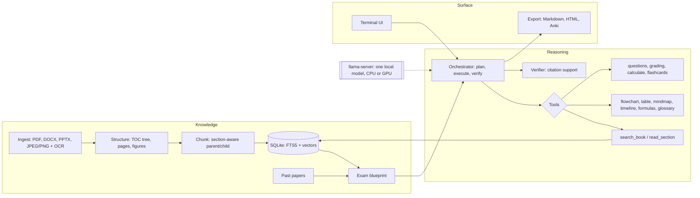

# Margin — design

An offline study assistant that reads the book the way the exam does.

Give it the messy material — a 900-page reference book, scanned notes, slides,
photos of the whiteboard — plus past question papers. It works out which parts
of the book the exam actually asks about, writes notes on those parts with
diagrams and tables, and sets practice questions in the style of the paper.

This document is the plan, the reasoning behind every architectural decision,
the evaluation suite, and the model report.

---

## 1. The problem

General chat-with-your-PDF tools treat every page as equally important. A
student's problem is the opposite: the book is huge, the exam is narrow, and
time is short.

Margin's core idea is the **exam blueprint**. Past papers are used as a map of
the book. Every past question is matched to the sections that answer it,
weighted by marks and how often it recurs, and that map decides what gets
notes, what gets questions, and what is skipped.

Everything runs on the student's own computer, and that computer may have no
GPU. That constraint shapes most of the decisions below.

## 2. Features

| Feature | What it does |
|---|---|
| Messy-document ingestion | PDF (text and scanned), DOCX, PPTX, JPEG and PNG photos. Recovers headings, page numbers and the book's table of contents. |
| Exam blueprint | Splits past papers into questions with marks and year, maps each to book sections, ranks chapters by exam weight. |
| Notes from the parts that matter | Section-by-section notes with page citations; depth scales with exam weight. |
| Visual tools | Flowcharts, comparison tables, mind maps, timelines, formula sheets, glossaries. |
| Agent orchestrator | Plans the job, calls tools, checks its output against the sources, resumes if interrupted. |
| Exam-style questions | Questions matching the paper's mix of marks and types, with model answers and marking schemes. |
| Answer checking | Marks a typed answer against the scheme and names the missing points and the page to reread. |
| Weak-topic loop | Quiz results raise the priority of topics the student keeps missing. |
| Flashcards | FSRS spaced-repetition scheduling, exportable to Anki. |
| Numerical verification | Worked answers are recomputed in a restricted evaluator before they are shown. |
| Revision sheet | One page of the highest-weight topics, formulas and definitions. |

Subjects: all of them — engineering, architecture, medicine and the rest. The
evaluation data deliberately spans all three named fields.

## 3. Architecture

Three layers with one-way dependencies. **Knowledge** turns documents into a
searchable, structured store. **Reasoning** is the orchestrator and its tools.
**Surface** is the terminal and the exported files. The evaluation suite sits
beside them and never imports the surface.



**How "make notes for Unit 3" flows:** the blueprint ranks Unit 3's sections by
exam weight → the orchestrator plans one step per section with a depth budget →
each step retrieves the section, drafts notes, and calls visual tools where the
content is a process, a comparison or a formula set → the verifier checks every
sentence against its cited passage → each step checkpoints to SQLite → results
assemble into Markdown and a self-contained HTML file.

### Code layout

```
src/margin/
  cli.py            the `margin` command
  config.py         MARGIN_HOME and its folders
  hardware.py       CPU/RAM/GPU detection, backend choice
  runtime/          llama.cpp binaries, model registry, server process, client
  agent/tools.py    tool schemas (pydantic) shared by the agent and the evals
evals/
  datasets/         passages, grounded QA, tool calls, structured tasks
  suites/           agentic, grounded, structured, speed
  spec.py           every metric: direction, band, gated or not
  regression.py     baseline comparison with dataset fingerprinting
  run.py            one model, one backend
  bench_models.py   every model, every backend → report tables
```

## 4. Decision records

Each record states what was chosen, why, what was rejected, and what evidence
would reverse it.

### D1 — Runs on CPU first; the GPU is an accelerator, not a requirement

- **Chosen:** every feature must work on a CPU-only laptop in acceptable time.
  A GPU, when found, runs the same model faster.
- **Why:** most students do not have an NVIDIA GPU. A study tool that needs one
  excludes its audience.
- **Consequence:** models are restricted to roughly 1–9 B parameters at 4-bit,
  and the default is picked by measured CPU speed, not by quality alone (D3).
- **Rejected:** a GPU-only design with a larger model — better answers for a
  small minority of users.
- **Reverse if:** never for the default; larger models stay available as options.

### D2 — llama.cpp prebuilt binaries, pinned, chosen by detected hardware

- **Chosen:** `margin setup` downloads the official llama.cpp `llama-server`
  build matching the machine — CUDA on Windows with NVIDIA, Vulkan on Linux GPUs,
  Metal on Apple Silicon, CPU otherwise — pinned to build `b10936`.
- **Why:** one engine covers every platform and both CPU and GPU with the same
  model files. Prebuilt binaries avoid a C++ compiler on the user's machine,
  which is what breaks `llama-cpp-python` installs on Windows. Pinning matters
  because chat-template and tool-call parsing change between builds, and an
  unpinned runtime makes evaluation numbers unrepeatable.
- **Rejected:** Ollama (a separate service to install, and it could not load
  the Qwen3.5 GGUFs with vision projectors at the time of writing);
  `llama-cpp-python` (compiles from source on many platforms); PyTorch or
  Transformers (gigabytes of install, slow on CPU).
- **Reverse if:** a platform has no official build.

### D3 — The model is chosen by benchmark, with the selection rule fixed before the results

- **Chosen:** nine candidates (§6) are measured on this project's own tasks.
  The rule, written before any result was seen: **the CPU default is the
  highest quality score among models whose CPU tool decision takes ≤ 10 s and
  whose memory fits 8 GB of RAM; the GPU default is the highest quality score
  that fits 8 GB of VRAM.**
- **Why:** public leaderboards measure general ability, not "pick the right
  study tool and fill its arguments from a student's request." Fixing the rule
  first stops the choice being rationalised after the fact.
- **Rejected:** choosing by leaderboard rank or model size.

### D4 — One process, one model, bound to loopback

- **Chosen:** one `llama-server` child process on `127.0.0.1` and a free port.
- **Why:** memory. A second model (a router, a judge) doubles RAM on the
  machines least able to afford it. Loopback means nothing leaves the machine.
- **Rejected:** a small router model plus a large writer model.

### D5 — The exam blueprint decides scope

- **Chosen:** every past question is retrieved against the book; section weight
  is the sum over matched questions of marks × recency, spread over the top
  matches by retrieval score.
- **Why:** it is the product's reason to exist, and it cuts compute: notes for a
  quarter of a book cost about a quarter of the time.
- **Rejected:** asking the model "which chapters matter?" — unmeasurable.
- **Reverse if:** top-3 mapping accuracy falls below ~70% on the gold set; then
  the blueprint only suggests and the student picks.

### D6 — A small orchestrator of our own: plan, execute, verify, checkpoint

- **Chosen:** an explicit state machine with a step limit. The model chooses
  tools inside a step; the loop's shape is code.
- **Why:** 1–9 B models drift in open-ended ReAct loops. A fixed outer loop keeps
  each model decision small, and checkpoints make every run resumable and
  replayable. It is short enough to explain line by line.
- **Rejected:** LangGraph (a good fit, but a dependency for features that are
  small to write here); multi-agent frameworks (several "agents" on one small
  model is one model taking turns, at several times the latency).
- **Reverse if:** the graph grows past a handful of node types or needs
  human-in-the-loop interrupts.

### D7 — One pydantic model per tool is both the prompt schema and the validator

- **Chosen:** tool parameters are pydantic models with `extra="forbid"`. The
  same class produces the JSON schema the model sees and validates what it
  returns.
- **Why:** a schema shown and a schema enforced that live in two places drift.
- **Rejected:** hand-written JSON schemas.

### D8 — Visual tools take structured data; code draws the picture

- **Chosen:** the model fills a schema (steps and edges, rows, branches);
  llama.cpp constrains generation with a grammar; Python renders Mermaid for HTML
  and Graphviz for print.
- **Why:** small models write Mermaid with syntax errors that only fail at
  render time. Constrained JSON is valid by construction and can be checked —
  every flowchart edge must point at an existing step.
- **Rejected:** letting the model write Mermaid directly.

### D9 — No PyTorch: ONNX Runtime for embeddings and OCR

- **Chosen:** `fastembed` (bge-small, ONNX) for embeddings and reranking,
  `rapidocr` (ONNX) for text in photos and scans.
- **Why:** install size drops from several GB to a few hundred MB, and ONNX
  Runtime is fast on CPU. One-command install is only pleasant if it is small.
- **Rejected:** sentence-transformers and PyTorch-based OCR.
- **Reverse if:** a vision-language model proves clearly better on photos of
  handwritten notes; then it is used for images only (measured in Phase 1).

### D10 — SQLite for everything

- **Chosen:** one file per workspace: FTS5 for keyword search, 384-dimensional
  vectors searched exactly, jobs and checkpoints in the same file.
- **Why:** a student's library is ~50,000 chunks × 384 floats ≈ 77 MB, and exact
  search over that takes milliseconds. Backup is copying a file.
- **Rejected:** Qdrant, Chroma, FAISS — a server or native build for a scale
  this project does not have.
- **Reverse if:** a workspace passes ~1M chunks or search p95 exceeds 200 ms.

### D11 — Hybrid retrieval, structure-aware chunks

- **Chosen:** keyword + vector search fused by rank, then a cross-encoder
  reranker. Chunks split on the book's headings: ~400-token children for search,
  the whole parent section for writing.
- **Why:** textbooks are full of exact terms (*Thévenin*, *nephron*) that keyword
  search catches and vectors blur. Fixed windows cut derivations in half.

### D12 — Generated questions must pass three checks

- **Chosen:** (1) answerable from the cited passage alone; (2) not a near-copy
  of a past question; (3) marks and type fit the paper's distribution.
- **Why:** a fluent question the source does not answer makes a student study
  the wrong thing.

### D13 — Terminal drives it; notes are files

- **Chosen:** a Textual terminal UI in a gold colour scheme; notes export to
  Markdown and self-contained HTML with rendered diagrams.
- **Why:** terminal-only operation was a requirement, and a terminal cannot draw
  a flowchart legibly past a few nodes.

### D14 — One-command install and run

- **Chosen:** `irm …/install.ps1 | iex` or `curl …/install.sh | sh` installs
  `uv` if missing, runs `uv tool install` (an isolated environment with its own
  Python), then `margin setup`. After that, `margin` is the only command.
- **Why:** `uv tool` gives every user the same Python version without touching
  their system Python, and it is how modern Python CLIs ship.
- **Rejected:** PyInstaller single binaries (large, antivirus false positives,
  one build per platform); `pip install` (collides with system packages).

### D15 — Offline is enforced by tests

- **Chosen:** a test fixture blocks every socket except loopback and runs the
  pipeline; model downloads happen only in `margin setup`.
- **Why:** libraries phone home quietly. "Offline" is only true if a test fails
  when it is not.

### D16 — Files are identified by their bytes, and photos are turned upright first

- **Chosen:** the reader sniffs magic bytes (`%PDF`, PNG, JPEG, WebP, ZIP part
  names for Word and PowerPoint) instead of trusting extensions. Images are
  rotated by their EXIF orientation and scaled to at most 2,500 px before OCR.
- **Why:** phone photos arrive as `.JPG`, `.jpeg` or with no extension, and a
  portrait photo stores its rotation in metadata, not pixels — skip that and OCR
  reads the page sideways. OCR accuracy stops improving well below 12 MP while
  time keeps growing. HEIC photos are refused with a message saying how to
  convert them, rather than failing obscurely.

### D17 — pdfium for PDFs; scanned pages detected per page

- **Chosen:** `pypdfium2` (BSD/Apache). A page with fewer than 40 characters in
  its text layer is rendered at 144 dpi and sent to OCR; the document records
  which pages came from OCR.
- **Why:** PyMuPDF is faster to write against but AGPL-licensed, which would
  force the whole project's licence. Per-page detection handles the common
  mixed case — a typed book with a few scanned appendix pages.

### D18 — Sections are anchored on text blocks, not page boundaries

- **Chosen:** PDF bookmarks are located *inside* their page's text; without
  bookmarks, numbered headings ("4.2 Kirchhoff's laws", "Chapter 7") are the
  anchors. Word headings come from paragraph styles; each slide is a section.
- **Why:** sections usually start mid-page. Page-level boundaries would put the
  end of 4.1 inside 4.2, and the exam blueprint maps questions to sections, so
  that error would move marks to the wrong topic.
- **Evidence on real books** (`evals/ingest_roundtrip.py`, two OpenStax textbooks):

  | Book | Pages | Bookmarks | Found in page text | Text kept in a section | Read speed |
  |---|---|---|---|---|---|
  | Anatomy & Physiology 2e | 1,347 | 409 | 100% | 100% | 328 pages/s |
  | University Physics Vol. 1 | 959 | 198 | 99% | 100% | 324 pages/s |

  The first run kept only 96.5% and 98.1% of the text. The cause: in 41 places
  the PDF text layer runs a heading straight into its paragraph ("Key Terms
  abdominopelvic cavity …"), and the builder discarded the whole block as a
  heading. It now strips just the title. About 17–19% of sections have no body
  of their own — chapter headings followed immediately by their first
  subsection — which is expected, not lost text.

### D19 — RapidOCR's default recogniser is kept for English

- **Chosen:** the default PP-OCRv6 small recogniser.
- **Evidence:** on the 13 synthetic page photos it scored 3.0% character error
  on typed pages and 2.6% on handwriting-style pages. Switching `lang_type` to
  English loaded the *same* model file and produced byte-identical output — the
  v6 small recogniser is multilingual. A comparison that returns identical
  numbers is a sign the setting never took effect, so the model file was checked
  before drawing any conclusion.

### D20 — A model is judged only after its tools demonstrably reached it

- **Chosen:** a model whose tool scores collapse is inspected before it is
  scored as bad. Where a chat template reads tools from its own variable, the
  model registry records it (`tools_template_kwarg`) and the client passes the
  tool list there as well as in the standard field.
- **Evidence:** SmolLM3 first scored 0.000 on tool arguments with zero tool calls
  in 49 cases. Its replies said *"as an AI, I don't have access to your files"*
  — the model had never been shown a tool. Its GGUF chat template renders tools
  only from `xml_tools`, while llama-server passes `tools`. The first result
  measured the plumbing, not the model, and was discarded.
- **It happened twice.** Phi-4-mini showed the same signature — 0 tool calls in
  49 cases, *"I can't directly access … your circuits book"* — while scoring
  1.0 on grounded answers. Its template reads tools only from a `tools` field on
  the system message, and llama-server drops unknown message fields before
  rendering — confirmed with `/apply-template`, whose output had no tool block.
  Margin now ships a replacement template (`runtime/templates/phi4-mini.jinja`,
  passed with `--chat-template-file`) and the first result (quality 0.738) was
  discarded.
- **Where the line is drawn.** Once the prompt demonstrably contained the tools,
  Phi-4-mini understood them — it named `create_flashcards` with the right
  arguments — but wrote the call as prose and a JSON code block instead of its
  `<|tool_call|>` format. That is scored as the model's behaviour. The client
  recovers calls written in a model's *own* call markup (`<tool_call>…</tool_call>`,
  `<|tool_call|>…<|/tool_call|>`) and reports how often it had to
  (`agent.text_parsed_call_rate`), but it does not fish JSON out of prose: that
  would rescue one model and misfire whenever any model merely explains a tool.
- **Why it matters:** a benchmark that silently scores a configuration error as
  model quality will pick the wrong model and cannot be defended when asked why.

### D21 — Retrieval: one SQLite workspace, paragraph chunks, hybrid search with a reranker

- **Chosen:** documents, sections, chunks, an FTS5 keyword index kept in step by
  triggers, and float32 vectors all live in one SQLite file per workspace.
  Sections are cut into chunks of whole paragraphs up to ~1,200 characters,
  never across a section boundary. A query runs BM25 and exact cosine search
  (bge-small, 384 dimensions) side by side, fuses the two rankings by reciprocal
  rank, and reranks the top 20 with a MiniLM cross-encoder.
- **Why:** one file cannot drift out of step with its own index, and backup is a
  copy. Keyword search catches the exact terms textbooks are built on; vectors
  catch paraphrase; fusing by *rank* needs no calibration between two
  incomparable score scales. Chunks that stay inside a section mean every hit
  names exactly one section, which the exam blueprint needs.
- **Measured on this CPU:** bge-small embeds ~236 passages/s (a 1,300-page book
  in ~20 s); the reranker scores ~340 pairs/s; both models together are 152 MB.
- **Rejected:** a vector database (a server for a scale this project lacks);
  vector-only search (loses terminology); overlapping chunks (not needed until a
  measurement says so).

### D22 — Exercise sections are indexed but excluded from default search

- **Chosen:** sections titled Review Questions, Conceptual Questions, Problems
  and similar are flagged at indexing time; default search skips them.
- **Why:** a student searching the book wants the explanation, not the list of
  questions about it. It also keeps the evaluation honest: the gold questions
  come from those sections, and an index that contained them would let every
  question retrieve itself.

### D23 — The retrieval gold set comes from the textbook's own questions, and was audited before use

- **Chosen:** OpenStax *University Physics Volume 1* lists each chapter's
  Conceptual Questions and Problems under the heading of the section they test.
  `build_retrieval_gold.py` turns that layout into 1,700+ questions labelled with
  their section — no hand labelling, and no labels chosen by the person
  building the retriever.
- **Two defects found before any result was computed:**
  1. The first build covered 4 of 17 chapters. In most chapters the PDF glues
     "Conceptual Questions" onto the end of the previous block, so the marker
     was never seen. Markers are now matched at the end of a block too, but only
     after a sentence end and with exact capitals, so prose such as "strategies
     for solving problems" cannot trigger them.
  2. The second build read the Answer Key at the back of the book, which repeats
     every question number with the *answer* in its place. Keeping the last copy
     of each id silently replaced questions with answers — "If two different
     theories describe observations equally well…" became "No, neither of these
     two theories is more valid…". Extraction now stops at the Answer Key
     bookmark and keeps the first copy of any repeated number.
- **Why it matters:** both defects would have produced plausible retrieval
  numbers. A skewed or corrupted gold set is worse than none, because it looks
  like evidence.

## 5. Evaluation suite

`evals/` is a regression suite in the same discipline as the previous project:
a frozen baseline per model and backend, a fast smoke tier and a full tier, and
a verdict of PASS, SUSPECT or FAIL.

### Datasets

| File | Rows | What |
|---|---|---|
| `passages.jsonl` | 13 | Textbook-style passages: electrical, civil, computer and mechanical engineering; architecture; medicine; pharmacology; biology; history of medicine |
| `grounded_qa.jsonl` | 34 | Questions on the passages, 8 of them deliberately unanswerable |
| `tool_calls.jsonl` | 49 | 14 simple, 10 tool-discrimination, 6 parallel, 8 no-tool, 5 multi-turn, 6 multi-step tasks |
| `structured.jsonl` | 17 | Flowcharts, tables, mind maps, formula sheets, a timeline, a glossary, question sets, notes |

### Metrics

**Agentic**

| Metric | Meaning |
|---|---|
| `agent.selection_acc` | Right tool(s) chosen |
| `agent.args_acc` | Right tool(s) *and* right arguments |
| `agent.parallel_acc` | Several independent calls in one turn, all correct |
| `agent.multi_turn_acc` | Correct call that depends on earlier turns ("open that section") |
| `agent.irrelevance_acc` | No tool called when none fits |
| `agent.schema_valid_rate` | Emitted arguments that validate against the schema |
| `agent.hallucinated_tool_rate` | Calls to tools that do not exist |
| `agent.task_success_rate` | Multi-step tasks: right order, right arguments, right final answer, stopped |
| `agent.trajectory_acc` | Required tools called in the required order |
| `agent.redundant_calls_per_task` | Calls beyond the required trajectory |
| `agent.steps_mean`, `agent.call_latency_mean_s` | Efficiency |

Multi-step tasks use fixture tool results, so they measure planning and
argument passing, not retrieval. Arguments are matched with operators
(`$contains`, `$one_of`, `$items_contain`, `$optional`…) after normalising case
and punctuation, so `"SYN-ACK"` and `"syn ack"` agree but a wrong section id
does not.

**Grounded answering:** `grounded.answer_acc`, `grounded.refusal_acc`,
`grounded.false_refusal_rate` — refusal is scored in both directions, because a
model that always refuses and one that never refuses fail differently.

**Structured material:** `structured.schema_valid_rate`,
`structured.key_term_coverage`, `structured.grounding`,
`structured.flowchart_edges_valid_rate`, `questions.answer_grounded_rate`,
`notes.key_term_coverage`, `notes.sentence_support_rate`. Coverage and grounding
are **lexical**: they reward the passage's words, not correct reasoning, and are
labelled as such wherever they appear.

**Speed and memory:** `speed.gen_tps`, `speed.prompt_tps`, `speed.ttft_long_s`,
`speed.load_s`, `speed.rss_gb`, `speed.vram_gb`.

### Rules

- **Quality gates; speed does not.** Speed depends on what else the machine is
  doing, and a guard that fires at random teaches people to ignore FAILs.
- **Bands:** absolute for rates, relative for timings. Within band PASS, within
  twice the band SUSPECT, beyond FAIL.
- **Fingerprinted baselines:** datasets and runtime build are hashed. A baseline
  from different data refuses to compare instead of comparing silently.
- **Smoke tier** keeps every third case *within each category*, so no category
  disappears from the quick check.
- **Deterministic:** temperature 0, seed 42, thinking off.

## 6. Model report

### How the benchmark was run

- **Machine:** laptop with AMD Ryzen 7 7435HS (8 cores), 24 GB RAM, NVIDIA RTX 4060
  Laptop GPU (8 GB). Windows 11. llama.cpp build `b10936` for both backends.
- **Quality is measured once, on the GPU, over the full tier** (49 tool-calling
  cases, 34 grounded questions, 17 structured tasks, 13 page photos). Quality
  depends on the weights and quantisation, not on which processor runs them.
- **Speed is measured on each backend.** The CPU pass also re-runs the smoke
  tier (every third case per category) as a cross-check that the CPU build
  gives the same quality. It did for the first model measured: LFM2.5-1.2B
  scored 0.804 on the GPU full tier and 0.809 on the CPU smoke tier.
- **Settings:** temperature 0, seed 42, thinking disabled, 8,192-token context,
  one request at a time, prompt cache on (as the product uses it) except in the
  speed suite, which turns it off so every repeat does the full work.
- **Selection rule, written before any result** (D3): CPU default = highest
  quality score among models whose CPU tool decision takes ≤ 10 s and whose
  memory fits 8 GB RAM; GPU default = highest quality score that fits 8 GB VRAM.

### Caveats that apply to every number below

- **Small samples.** On the full tier one tool-calling case moves a category
  rate by 2–17 points depending on the category (6 parallel cases, 8 no-tool
  cases). Differences of a case or two are noise; the table is for spotting
  large gaps.
- **Content metrics are lexical.** Coverage and grounding reward the passage's
  words, not correct reasoning.
- **The page photos are synthetic** — clean renders in typed and
  handwriting-style fonts with simulated degradation. Real phone photos of
  real handwriting will be harder for every reader, OCR and model alike.
- **Speed numbers are for this laptop**, measured with nothing else heavy
  running. They rank the models; they do not predict another machine.
- **The composite quality score has a known blind spot.** It averages nine
  metrics equally, and one of them is "no tool called when none fits". A model
  that never calls a tool scores 1.0 there for free, which lifts its composite.
  Read the composite next to tool-argument accuracy and task success, never
  alone. It is kept unchanged because the selection rule (D3) was fixed before
  the results, and changing the score after seeing them would defeat that.

Candidates, all 4-bit GGUF:

| Model | Params | Download | Vision | Licence |
|---|---|---|---|---|
| LiquidAI LFM2.5 1.2B Instruct | 1.2 B | 0.68 GB | — | LFM Open License |
| Qwen3.5 2B | 2 B | 1.19 GB | yes | Apache-2.0 |
| Gemma 4 E2B | 2.3 B effective | 2.65 GB | yes | Gemma |
| IBM Granite 4.1 3B | 3 B | 1.96 GB | — | Apache-2.0 |
| SmolLM3 3B | 3.1 B | 1.78 GB | — | Apache-2.0 |
| Phi-4-mini | 3.8 B | 2.32 GB | — | MIT |
| Qwen3.5 4B | 4 B | 2.55 GB | yes | Apache-2.0 |
| Gemma 4 E4B | 4.5 B effective | 4.28 GB | yes | Gemma |
| Qwen3.5 9B | 9 B | 5.29 GB | yes | Apache-2.0 |

### What the rule chose

Applied mechanically by `evals/bench_models.py` (`select_defaults`):

- **CPU default: Gemma 4 E4B.** Quality 0.932. On CPU a tool decision takes
  6.4 s and the server peaks at 6.1 GB with vision loaded. Granite 4.1 3B scored
  0.001 higher but missed the CPU limit: its tool decision took 10.6 s against
  a 10 s bound.
- **GPU default: Granite 4.1 3B.** Quality 0.933, 2.75 GB of VRAM.

**The GPU choice is a tie, and should be read as one.** 0.933 against 0.932 is
smaller than the effect of a single test case. The rule breaks the tie
mechanically, as it was written to. Two facts from the same run argue the
other way and are recorded here rather than acted on silently:

1. Granite has no vision. Photos are a required input, so a Granite default
   reads every photo with RapidOCR (3.0% character error on typed pages, 2.6% on
   handwriting-style pages), where Gemma 4 E4B reads them itself (2.9% and 0.8%).
2. Granite emits one tool call per turn (parallel accuracy 0.000), where Gemma 4
   E4B scored 1.000.

Using Gemma 4 E4B on both backends would also mean one download for every
user. That is a product decision against a pre-registered rule, so it was left
to the project owner.

**Decision (2026-09-13): Gemma 4 E4B is the default on both CPU and GPU.** The
rule's GPU result was a tie, and the owner broke it on the two facts above plus
the single download. The rule's output is kept in the tables unchanged, so the
override is visible rather than rewritten into the numbers.

### What each model is like

- **Gemma 4 E4B** — the most even profile: tool arguments 0.943, parallel 1.000,
  every grounded question and refusal right, notes fully supported. Its schema-
  valid rate (0.820) is the lowest of the models that call tools natively, and
  on CPU it is slow to start on long prompts (28.8 s to first token on a
  2,000-token prompt).
- **Granite 4.1 3B** — the best composite and the only model with every notes
  sentence, grounded answer and refusal correct *and* 5 of 6 multi-step tasks,
  but it never makes two calls in one turn.
- **Qwen3.5 2B** — the surprise: perfect tool arguments and all 6 tasks at 2 B
  parameters. Its notes are the least grounded (0.742 of sentences supported),
  so it adds material the passage does not contain.
- **Qwen3.5 4B / 9B** — tool arguments 0.971 on both. The 9B is the best on
  content (coverage and notes both 1.000, zero character errors reading photos)
  but the slowest on GPU (37.8 tokens/s). Its task score (0.500) includes one
  harness failure, disclosed below. On CPU it is out of reach: 7.1 tokens/s,
  19.7 s per tool decision, 59 s to first token on a 2,000-token prompt and
  8.2 GB of memory (9.4 GB with vision) — it breaks both CPU limits.
- **Gemma 4 E2B** — close behind E4B (0.919) at half the CPU latency; the
  candidate for machines where E4B is too slow.
- **LFM2.5 1.2B** — by far the fastest (144 tokens/s on GPU, 45 on CPU) but it
  answers questions the passage cannot answer: refusal accuracy 0.250.
- **SmolLM3 3B** — tool arguments 0.829 once its tools were delivered correctly
  (D20), but every call had to be recovered from reply text, and it completed
  only 2 of 6 tasks, repeating calls or refusing midway.
- **Phi-4-mini** — understands tools but describes the call in prose instead
  of making it: tool arguments 0.029. Not usable as an agent in this runtime.

### Findings that change the product

- **Photos: OCR first, vision model optional.** Every vision model read the
  synthetic pages at least as well as RapidOCR on GPU (0–3.8% character error),
  but on CPU a vision model took 13–30 s per page against ~1 s for OCR.
  Ingestion therefore uses RapidOCR by default; a vision model is an option
  when a GPU is present. This confirms D9.
- **Expect about a minute per section of notes on a CPU** with the default
  model — 29 s to read a 2,000-token section and ~33 s to write 400 tokens at
  12.2 tokens/s. The interface must show progress, and Gemma 4 E2B roughly
  halves the time.
- **Tool turns need a larger output budget and a repair path.** Qwen3.5 9B
  wrote a 3,652-character table argument in task-05, hit the 1,024-token cap,
  and llama-server rejected the truncated JSON with HTTP 500. The task was
  scored as an error. Counting it as a success would lift the 9B to about 0.912,
  which changes no default, so the result stands with this disclosure; the
  orchestrator will raise the budget and return parse errors to the model for
  one retry.
- **Flowcharts need edge repair.** Several models point edges at step labels
  instead of step ids; the renderer will resolve labels before rejecting a chart.

### Full tables

Generated from every result file by `write_report()`.

<!-- bench-tables:start -->

### Quality (backend: cuda)

| Model | Quality | Tool args | No-tool | Parallel | Tasks | Valid calls | Text-parsed | QA | Refusal | Coverage | Notes support |
|---|---|---|---|---|---|---|---|---|---|---|---|
| lfm2.5-1.2b | 0.804 | 0.829 | 1.000 | 1.000 | 0.500 | 0.885 | — | 0.962 | 0.250 | 0.981 | 0.889 |
| qwen3.5-2b | 0.903 | 1.000 | 1.000 | 1.000 | 1.000 | 1.000 | — | 1.000 | 1.000 | 0.908 | 0.742 |
| gemma4-e2b | 0.919 | 0.914 | 1.000 | 0.833 | 0.667 | 0.843 | — | 1.000 | 0.875 | 1.000 | 0.938 |
| granite4.1-3b | 0.933 | 0.829 | 1.000 | 0.000 | 0.833 | 1.000 | — | 1.000 | 1.000 | 0.985 | 1.000 |
| smollm3-3b | 0.773 | 0.829 | 1.000 | 0.833 | 0.333 | 0.925 | 1.00 | 1.000 | 0.625 | 0.962 | 0.923 |
| phi4-mini | 0.733 | 0.029 | 1.000 | 0.000 | 0.000 | 1.000 | 0.00 | 1.000 | 1.000 | 0.915 | 0.844 |
| qwen3.5-4b | 0.907 | 0.971 | 1.000 | 1.000 | 0.833 | 1.000 | 0.00 | 1.000 | 1.000 | 0.942 | 0.893 |
| gemma4-e4b | 0.932 | 0.943 | 1.000 | 1.000 | 0.667 | 0.820 | 0.00 | 1.000 | 1.000 | 0.962 | 1.000 |
| qwen3.5-9b | 0.909 | 0.971 | 0.875 | 1.000 | 0.500 | 1.000 | 0.00 | 1.000 | 1.000 | 1.000 | 1.000 |

### Speed and memory (backend: cuda)

| Model | Gen tok/s | Prompt tok/s | TTFT 2k (s) | Tool call (s) | RAM (GB) | VRAM (GB) | Load (s) |
|---|---|---|---|---|---|---|---|
| lfm2.5-1.2b | 144.2 | 5069 | 0.34 | 0.40 | 1.11 | 0.94 | 3.2 |
| qwen3.5-2b | 93.5 | 2884 | 0.60 | 0.81 | 1.82 | 1.45 | 2.6 |
| gemma4-e2b | 105.4 | 4363 | 0.38 | 0.49 | 2.11 | 1.71 | 2.6 |
| granite4.1-3b | 90.3 | 3647 | 0.46 | 0.64 | 2.52 | 2.75 | 2.1 |
| smollm3-3b | 90.1 | 4400 | 0.40 | 0.65 | 2.36 | 2.53 | 2.2 |
| phi4-mini | 76.4 | 3889 | 0.43 | 1.74 | 3.00 | 3.49 | 3.2 |
| qwen3.5-4b | 67.3 | 2320 | 0.74 | 1.09 | 3.40 | 3.02 | 3.2 |
| gemma4-e4b | 57.6 | 2681 | 0.62 | 0.86 | 3.57 | 3.18 | 5.4 |
| qwen3.5-9b | 37.8 | 1663 | 1.04 | 1.71 | 5.62 | 5.25 | 4.8 |

### Reading photos (backend: cuda)

| Model | CER typed | CER hand | s / image | RAM (GB) | OCR CER typed | OCR CER hand | OCR s / image |
|---|---|---|---|---|---|---|---|
| qwen3.5-2b | 0.000 | 0.005 | 1.6 | 2.40 | 0.030 | 0.026 | 1.00 |
| gemma4-e2b | 0.038 | 0.011 | 1.5 | 2.36 | 0.030 | 0.026 | 0.97 |
| qwen3.5-4b | 0.000 | 0.000 | 2.7 | 4.71 | 0.030 | 0.026 | 1.14 |
| gemma4-e4b | 0.029 | 0.008 | 2.3 | 4.07 | 0.030 | 0.026 | 1.03 |
| qwen3.5-9b | 0.000 | 0.000 | 5.0 | 6.93 | 0.030 | 0.026 | 1.10 |

### Speed and memory (backend: cpu)

| Model | Gen tok/s | Prompt tok/s | TTFT 2k (s) | Tool call (s) | RAM (GB) | VRAM (GB) | Load (s) |
|---|---|---|---|---|---|---|---|
| lfm2.5-1.2b | 45.1 | 244 | 7.01 | 6.53 | 1.37 | — | 1.1 |
| qwen3.5-2b | 23.4 | 115 | 14.95 | 5.66 | 2.08 | — | 2.6 |
| gemma4-e2b | 22.8 | 117 | 14.17 | 3.13 | 2.72 | — | 3.2 |
| granite4.1-3b | 16.8 | 76 | 22.34 | 10.59 | 4.27 | — | 3.0 |
| smollm3-3b | 19.6 | 81 | 21.67 | 8.81 | 3.90 | — | 2.6 |
| phi4-mini | 15.9 | 82 | 20.26 | 12.59 | 4.91 | — | 3.2 |
| qwen3.5-4b | 11.9 | 66 | 25.96 | 10.72 | 4.65 | — | 3.2 |
| gemma4-e4b | 12.2 | 57 | 28.79 | 6.36 | 5.26 | — | 4.9 |
| qwen3.5-9b | 7.1 | 29 | 59.14 | 19.74 | 8.18 | — | 5.9 |

### Reading photos (backend: cpu)

| Model | CER typed | CER hand | s / image | RAM (GB) | OCR CER typed | OCR CER hand | OCR s / image |
|---|---|---|---|---|---|---|---|
| qwen3.5-2b | 0.000 | 0.000 | 17.5 | 2.93 | 0.071 | 0.076 | 1.05 |
| gemma4-e2b | 0.000 | 0.018 | 13.4 | 3.37 | 0.071 | 0.076 | 1.10 |
| qwen3.5-4b | 0.000 | 0.000 | 30.4 | 5.62 | 0.071 | 0.076 | 1.03 |
| gemma4-e4b | 0.005 | 0.024 | 20.7 | 6.07 | 0.071 | 0.076 | 1.02 |
| qwen3.5-9b | 0.000 | 0.000 | 56.0 | 9.40 | 0.071 | 0.076 | 1.14 |

### Defaults by the selection rule (D3)

- CPU default (quality from cuda; CPU tool decision <= 10 s, memory <= 8 GB): **gemma4-e4b**
- GPU default (fits 8 GB VRAM): **granite4.1-3b**

<!-- bench-tables:end -->

## 7. Build order

| Phase | Work | Done when | Status |
|---|---|---|---|
| 0 | Scaffold, runtime manager, CLI, install scripts, eval suite (agentic, grounded, structured, speed, vision), model benchmark | benchmark report written, default model chosen | in progress: suite built and validated, benchmark running |
| 1 | Ingestion: PDF, DOCX, PPTX, JPEG/PNG with OCR; TOC tree; page anchors | a textbook PDF round-trips with every section and page | done: 53 unit tests incl. OCR end to end; two OpenStax textbooks (2,306 pages) round-trip with 99–100% of bookmarks anchored and 100% of text kept (D18) |
| 2 | Retrieval on textbooks: hybrid search, parent/child chunks | hit@5 recorded as baseline | |
| 3 | Exam blueprint: past-paper parser, question→section mapping, weights | top-3 mapping accuracy measured | |
| 4 | Visual tools: schemas, renderers | generated diagrams render with zero failures | |
| 5 | Orchestrator and notes: loop, verifier, checkpoints, export | a chapter survives a mid-run kill and resumes | |
| 6 | Questions and practice: generation checks, grading, FSRS, Anki | answerable rate and marker agreement measured | |
| 7 | Terminal UI | the whole flow runs from the UI | |
| 8 | Packaging: README, demo recording, release | a stranger installs and runs the demo in 15 minutes plus download | |
