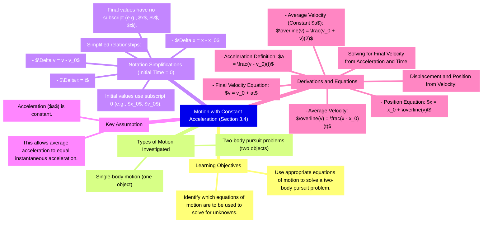
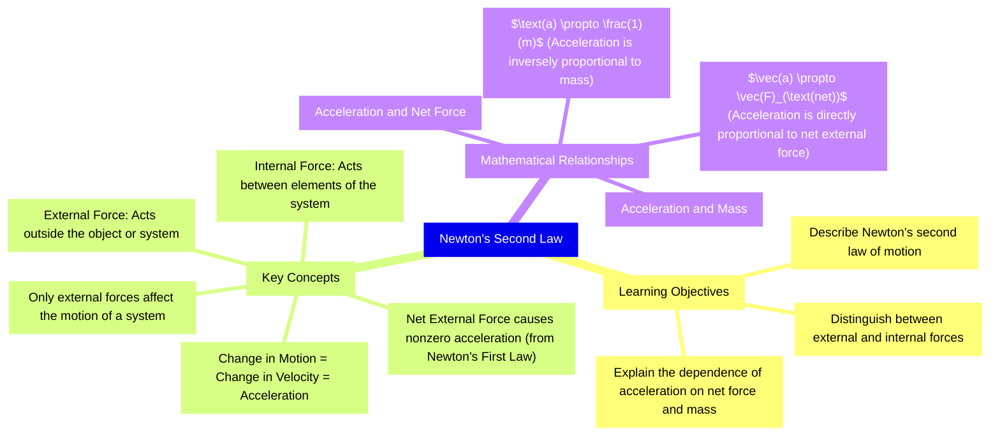
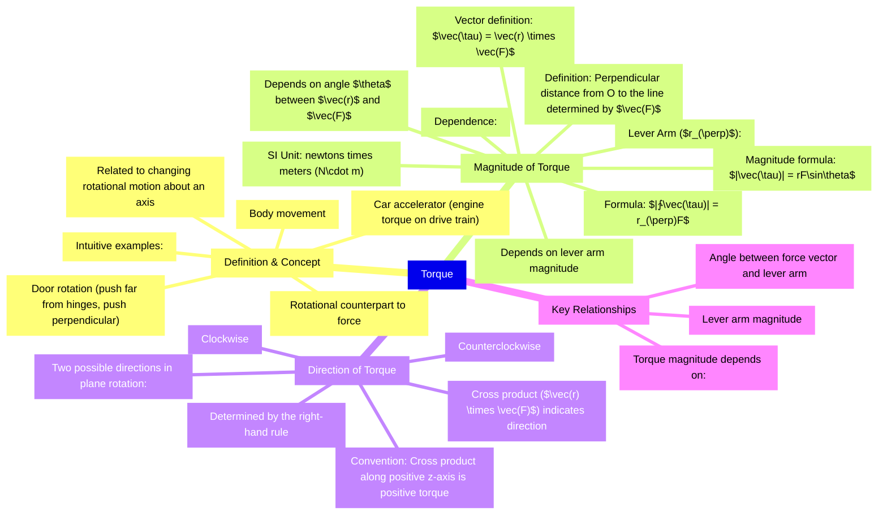
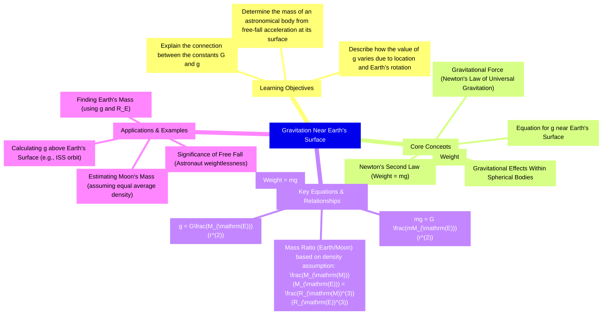
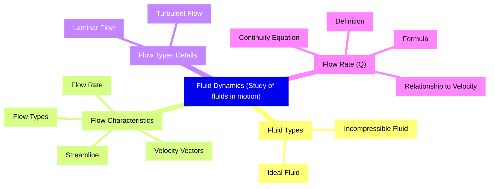

# 3.4 Motion with Constant Acceleration

*   The section investigates kinematic relationships for single-body motion and two-body pursuit problems, assuming **constant acceleration**.
*   **Notation Simplifications** (when initial time $t_0 = 0$):
    *   $\Delta t = t$
    *   $\Delta x = x - x_0$
    *   $\Delta v = v - v_0$
    *   $x_0$ and $v_0$ denote initial values; $x$ and $v$ denote final values.
*   When acceleration ($a$) is constant, the **average acceleration** equals the **instantaneous acceleration**.

### Displacement and Position from Velocity

*   The average velocity ($\overline{v}$) is defined as:
    $$\overline{v} = \frac{\Delta x}{\Delta t}$$
*   When acceleration is constant, the average velocity is the simple average of the initial and final velocities:
    $$\overline{v} = \frac{v_0 + v}{2}$$
*   Solving for position ($x$):
    $$x = x_0 + \overline{v}t$$

### Solving for Final Velocity from Acceleration and Time

*   The definition of acceleration is:
    $$a = \frac{\Delta v}{\Delta t}$$
*   Solving for final velocity ($v$):
    $$v = v_0 + at$$

**Key Terms:**
*   **Constant Acceleration**: Acceleration that does not change over time.
*   **Single-body motion**: Motion of one object.
*   **Two-body pursuit problems**: Motion involving two objects.
*   **Average Velocity** ($\overline{v}$): The total displacement divided by the total time.

**Equations:**
*   $\Delta v = v - v_0$
*   $\Delta x = x - x_0$
*   $\Delta t = t$
*   $\overline{v} = \frac{v_0 + v}{2}$
*   $x = x_0 + \overline{v}t$
*   $v = v_0 + at$

---

# 5.3 Newton's Second Law

*   **Newton's second law** mathematically describes the cause-and-effect relationship between **force** and changes in motion.
*   It is a **quantitative** law used to calculate outcomes involving a force.
*   A **change in motion** is equivalent to a **change in velocity**, which means there is **acceleration**.
*   A **net external force** causes **nonzero acceleration**.
*   An **external force** acts on an object or system and originates outside of it.
*   An **internal force** acts between elements of the system.
*   Only **external forces** affect the motion of a system.
*   The relationship between acceleration ($\mathbf{a}$) and **net external force** ($\mathbf{F}_{\text{net}}$) is proportional: $\vec{\mathbf{a}} \propto \vec{\mathbf{F}}_{\text{net}}$.
*   The relationship between acceleration ($\mathbf{a}$) and **mass** ($m$) is inversely proportional: $a \propto \frac{1}{m}$.

**Key Terms:**
*   **External force**
*   **Internal force**
*   **Net external force** ($\mathbf{F}_{\text{net}}$)
*   **Acceleration** ($\mathbf{a}$)
*   **Mass** ($m$)

**Equations:**
*   $\vec{\mathbf{a}} \propto \vec{\mathbf{F}}_{\text{net}}$
*   $a \propto \frac{1}{m}$

---

# 6.2 Friction

*   **Friction** is a force that opposes relative motion between systems in contact.
*   Friction is caused in part by the **roughness** of the surfaces in contact and **adhesive forces** between surface molecules.
*   **Kinetic friction** occurs when two systems are in contact and moving relative to one another.
*   **Static friction** occurs when two systems are in contact and stationary relative to one another.
*   Static friction is generally greater than kinetic friction.
*   Static friction is a **responsive force** that increases to be equal and in the opposite direction of the applied push, up to a maximum limit.
*   Once the applied force exceeds the maximum static friction, the object moves, and the friction transitions to kinetic friction.
*   At small but nonzero speeds, friction is nearly independent of speed.

**Key Terms:**
*   **Friction**: A force opposing relative motion between contacting systems.
*   **Kinetic friction**: Friction between moving systems.
*   **Static friction**: Friction between stationary systems.
*   **Coefficient of static friction** ($\mu_{\mathrm{s}}$): A factor determining the maximum static friction.
*   **Coefficient of kinetic friction** ($\mu_{\mathrm{k}}$): A factor determining the kinetic friction.
*   **Normal force** ($N$): The force perpendicular to the contact surfaces.

**Equations:**
*   Maximum static friction: $f_{\mathrm{s}}(\mathrm{max}) = \mu_{\mathrm{s}}N$
*   Kinetic friction: $f_{\mathrm{k}} = \mu_{\mathrm{k}}N$
*   General static friction condition: $f_{\mathrm{s}} \leq \mu_{\mathrm{s}}N$

**Comparison of Static and Kinetic Friction**

| Feature | Static Friction ($f_s$) | Kinetic Friction ($f_k$) |
|---|---|---|
| Definition | Friction between two systems in contact and stationary relative to one another. | Friction between two systems in contact and moving relative to one another. |
| Nature of Force | Responsive force that increases to be equal and in the opposite direction of the applied push, up to a maximum limit. | Force that opposes motion once the objects are in motion. |
| Magnitude Relationship | Usually greater than kinetic friction. | Less than static friction (once motion has started). |
| Maximum Value Equation | $f_{ ext{s}}( ext{max}) = ext{μ}_{ ext{s}}N$ | $f_{ ext{k}} = ext{μ}_{ ext{k}}N$ |
| Coefficient Used | Coefficient of static friction ($ ext{μ}_{ ext{s}}$) | Coefficient of kinetic friction ($ ext{μ}_{ ext{k}}$) |

---

# 10.6 Torque

*   **Torque** is the rotational counterpart to force, related to changing the rotational motion of an object about an axis.
*   Torque has both **magnitude** and **direction**.
*   In planar rotation, torque can be either **clockwise** or **counterclockwise** relative to the pivot point.
*   The magnitude of torque depends on the magnitude of the **lever arm** and the angle the force vector makes with the lever arm.
*   The **lever arm** ($r_{\perp}$) is the perpendicular distance from the pivot point (O) to the line determined by the force vector ($\mathbf{F}$).
*   The direction of torque is determined by the **right-hand rule** using the cross product $\vec{\mathbf{r}} \times \vec{\mathbf{F}}$.

**Key Terms:**
*   **Torque** ($\vec{\tau}$): The turning or twisting effectiveness of a force.
*   **Lever arm** ($r_{\perp}$): The perpendicular distance from O to the line determined by $\mathbf{F}$.
*   **Cross product** ($\vec{\mathbf{r}} \times \vec{\mathbf{F}}$): Used to define torque in three dimensions and determine its direction.

**Equations:**
*   $\vec{\mathbf{r}}=\vec{\mathbf{r}}\times\vec{\mathbf{F}}$
*   $\left|{\vec{\tau}}\right|=\left|{\vec{\bf r}}\,\times\,{\vec{\bf F}}\right|=rF{\sin\theta}$
*   $|\vec{\tau}|=r_{\perp}F$

**Notes:**
*   The SI unit of torque is **newtons times meters** ($\text{N}\cdot\text{m}$).
*   When $\theta=0^{\circ}$, the torque is zero.
*   When $\theta=90^{\circ}$, the torque is maximum.

---

# 13.2 Gravitation Near Earth's Surface

*   The acceleration of a free-falling object near Earth's surface is approximately $\text{g} = 9.80~\mathrm{m/s}^{2}$.
*   The force causing this acceleration is the **weight** of the object, given by $\text{mg}$.
*   Substituting $\text{mg}$ for the gravitational force in Newton's law of universal gravitation yields the scalar equation:
    $$\text{mg}=G\,\frac{mM_{\mathrm{E}}}{r^{2}}$$
*   The mass of the object ($\text{m}$) cancels, resulting in:
    $$\text{g}=G\frac{M_{\mathrm{E}}}{r^{2}}$$
*   For objects near Earth's surface, the distance $\text{r}$ can be taken as the average radius of Earth, $\text{R}_{\mathrm{E}}$.
*   The mass of Earth ($\text{M}_{\mathrm{E}}$) can be determined using the standard values of $\text{g}$ and $\text{R}_{\mathrm{E}}$ by rearranging the equation:
    $$M_{\mathrm{E}} = \frac{\text{g}r^{2}}{G}$$
*   The mass of the Moon ($\text{M}_{\mathrm{M}}$) can be estimated by assuming it has the same average density as Earth, leading to the ratio:
    $$\frac{M_{\mathrm{M}}}{M_{\mathrm{E}}}=\frac{R_{\mathrm{M}}^{3}}{R_{\mathrm{E}}^{3}}$$
*   The value of $\text{g}$ at a height above Earth's surface is calculated using the formula:
    $$\text{g}=G\frac{M_{\mathrm{E}}}{r^{2}}$$
    where $\text{r} = \text{R}_{\mathrm{E}} + \text{height}$.
*   Astronaut weightlessness in orbit is due to being in **free fall**.

**Key Terms:**
*   **Weight**
*   **Gravitational force**
*   **Free fall**
*   **Average radius of Earth**
*   **Gravitational Field Equation**

**Equations:**
$$\text{g}=G\frac{M_{\mathrm{E}}}{r^{2}}$$
$$\frac{M_{\mathrm{M}}}{M_{\mathrm{E}}}=\frac{R_{\mathrm{M}}^{3}}{R_{\mathrm{E}}^{3}}$$

---

# 14.5 Fluid Dynamics

*   **Fluid Dynamics** is the study of **fluids in motion**, contrasting with **fluid statics** (study of fluids at rest).
*   **Ideal fluid** is a fluid with negligible **viscosity** (internal friction).
*   For an **incompressible fluid**, the **density** is constant throughout, requiring a very large force to change its volume.
*   **Velocity vectors** represent fluid motion by indicating the speed and direction of the fluid at any point.
*   A **streamline** represents the path of a small volume of fluid, and the velocity is always tangential to it.
*   **Laminar flow** is characterized by smooth, parallel streamlines (sometimes called steady flow).
*   **No slip boundary conditions** are a special case of laminar flow where friction between the pipe and fluid is high, causing velocity to be greatest in the center and decrease near the walls.
*   **Turbulent flow** is characterized by irregular streamlines, mixing, and swirling, often occurring when fluid speed reaches a critical speed.
*   **Flow rate ($Q$)**, or **volume flow rate**, is the volume of fluid passing a given location through an area during a period of time.
*   The definition of flow rate is given by: $$Q=\frac{dV}{dt}$$
*   For a cylinder of cross-sectional area $A$ moving a distance $x$ in time $t$, the flow rate is: $$Q=\frac{dV}{dt}=\frac{d}{dt}(Ax)=A\frac{dx}{dt}=Av$$
*   The precise relationship between flow rate ($Q$) and average speed ($v$) is: $$Q=Av$$
*   Flow rate is directly proportional to both the average speed of the fluid and the cross-sectional area of the conduit.
*   For an **incompressible fluid** with no sources or sinks, the mass flowing into a section must equal the mass flowing out, meaning the **flow rate** must be the same at all points along the pipe.
*   For arbitrary points 1 and 2 in a pipe: $$A_{1}\upsilon_{1} = A_{2}\upsilon_{2}$$
*   This implies: $$Q_{1} = Q_{2}$$

**Key Terms:**
*   **Fluid Dynamics**
*   **Ideal fluid**
*   **Viscosity**
*   **Incompressible fluid**
*   **Velocity vectors**
*   **Streamline**
*   **Laminar flow**
*   **No slip boundary conditions**
*   **Turbulent flow**
*   **Flow rate ($Q$)**
*   **Volume flow rate**

**Equations:**
$$Q=\frac{dV}{dt}$$
$$Q=Av$$
$$A_{1}\upsilon_{1} = A_{2}\upsilon_{2}$$

