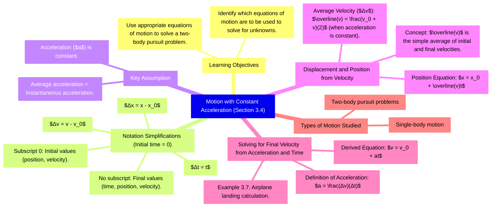
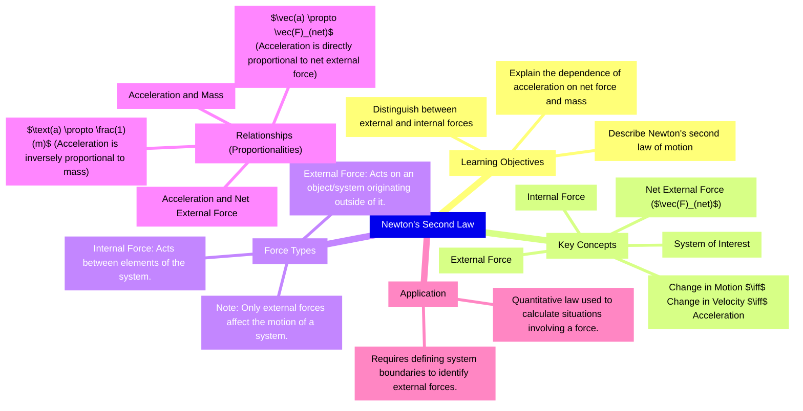
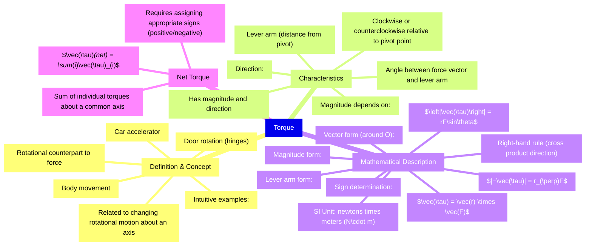
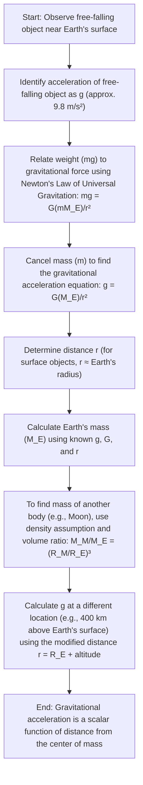

# 3.4 Motion with Constant Acceleration

*   **Notation Simplifications (Initial time $t_0 = 0$):**
    *   Elapsed time: $\Delta t = t$
    *   Displacement: $\Delta x = x - x_0$
    *   Change in velocity: $\Delta v = v - v_0$
    *   Subscript '0' denotes initial values; no subscript denotes final values.
*   **Constant Acceleration Assumption:** When acceleration ($a$) is constant, the average acceleration equals the instantaneous acceleration.
*   **Displacement and Position from Velocity:**
    *   Average velocity ($\overline{v}$): $\overline{v} = \frac{v_0 + v}{2}$
    *   Position equation: $x = x_0 + \overline{v}t$
*   **Solving for Final Velocity from Acceleration and Time:**
    *   Acceleration definition: $a = \frac{\Delta v}{\Delta t}$
    *   Final velocity equation: $v = v_0 + at$

**Key Terms:**
*   **Constant Acceleration:** Acceleration that does not change over time.
*   **Single-body motion:** Motion of one object.
*   **Two-body pursuit problems:** Motion involving two objects.
*   **Average Velocity ($\overline{v}$):** The average of the initial and final velocities when acceleration is constant.

**Equations:**
*   $\Delta t = t$
*   $\Delta x = x - x_0$
*   $\Delta v = v - v_0$
*   $\overline{v} = \frac{v_0 + v}{2}$
*   $x = x_0 + \overline{v}t$
*   $a = \frac{v - v_0}{t}$
*   $v = v_0 + at$

---

# Section 5.3 Newton's Second Law

*   **Newton's second law** mathematically describes the cause-and-effect relationship between **force** and changes in motion.
*   It is a **quantitative** law used to calculate outcomes involving a force.
*   A **change in motion** is equivalent to a **change in velocity**, which means there is **acceleration**.
*   A **net external force** causes **nonzero acceleration**.
*   An **external force** acts on an object or system and originates outside of it.
*   An **internal force** acts between elements of the system.
*   Only **external forces** affect the motion of a system.
*   The relationship between acceleration ($\vec{a}$) and **net external force** ($\vec{F}_{\text{net}}$) is proportional: $\vec{a} \propto \vec{F}_{\text{net}}$.
*   The relationship between acceleration ($a$) and **mass** ($m$) is inversely proportional: $a \propto \frac{1}{m}$.
*   Experiments confirm that acceleration is exactly inversely proportional to mass and directly proportional to net external force.

---

# 6.2 Friction

*   **Friction** is a force that opposes relative motion between systems in contact.
*   Friction is a common yet complex force.
*   Friction arises in part due to the **roughness** of the surfaces in contact.
*   Part of the friction is due to **adhesive forces** between the surface molecules of the two objects.

### Types of Friction

*   **Static friction:** Acts between two systems that are in contact and **stationary** relative to one another.
*   **Kinetic friction:** Acts between two systems that are in contact and **moving** relative to one another.
*   Static friction is usually greater than kinetic friction.
*   Once an object is moving, it is easier to keep it moving than it was to get it started, meaning the kinetic frictional force is less than the static frictional force.

### Magnitude of Friction

*   **Static friction** is a responsive force that increases to be equal and opposite to whatever force is exerted, up to its maximum limit.
*   The maximum magnitude of static friction is given by:
    $$f_{\mathrm{s}}(\mathrm{max})=\mu_{\mathrm{s}}\,N$$
    where $\mu_{\mathrm{s}}$ is the **coefficient of static friction** and $N$ is the magnitude of the **normal force**.
*   The general condition for static friction is:
    $$f_{\mathrm{s}}\leq\mu_{\mathrm{s}}N$$
*   The magnitude of kinetic friction is given by:
    $$f_{\mathrm{k}}=\mu_{\mathrm{k}}N$$
    where $\mu_{\mathrm{k}}$ is the **coefficient of kinetic friction**.

**Comparison of Static and Kinetic Friction**

| Type of Friction | Condition | Description/Behavior | Governing Equation (Magnitude) |
|---|---|---|---|
| Static Friction | Objects are stationary relative to one another | Responds to applied force; increases to be equal and opposite to the push up to a maximum limit. | f_s(max) = μ_s N |
| Kinetic Friction | Objects are moving relative to one another | Opposes motion; once motion starts, it is generally easier to keep it moving than to start it. | f_k = μ_k N |

---

# 10.6 Torque

*   **Torque** is the rotational counterpart to force, related to changing the rotational motion of an object about an axis.
*   Torque has both **magnitude** and **direction**.
*   In rotation in a plane, torque can be either **clockwise** or **counterclockwise** relative to the chosen pivot point.
*   The magnitude of torque depends on the **lever arm** and the angle the force vector makes with the lever arm.
*   The **SI unit** of torque is **newtons times meters** ($\text{N}\cdot\text{m}$).
*   The **lever arm** is the perpendicular distance from the pivot point to the line determined by the force vector.

**Formulas:**

*   Torque vector: $\vec{\mathbf{\tau}}=\vec{\mathbf{r}}\times\vec{\mathbf{F}}$
*   Magnitude of torque: $\left|{\vec{\tau}}\right|=\left|{\vec{\bf r}}\,\times\,{\vec{\bf F}}\right|=rF{\sin\theta}$
*   Magnitude of torque using lever arm: $|\vec{\tau}|=r_{\perp}F$
*   Net torque: $\vec{\tau}_{\mathrm{net}}=\sum_{i}\vec{\tau}_{i}$

**Key Terms:**

*   **Torque**: The turning or twisting effectiveness of a force.
*   **Lever arm**: The perpendicular distance from the pivot point to the line determined by the force vector.
*   **Right-hand rule**: Used to determine the sign (direction) of a torque.

---

# 13.2 Gravitation Near Earth's Surface

*   The acceleration of a free-falling object near Earth's surface is approximately $g$.
*   The force causing this acceleration is the **weight** of the object, with a value of $mg$.
*   Substituting $mg$ for the magnitude of the gravitational force in Newton's law of universal gravitation yields the scalar equation:
    $$mg=G\,\frac{mM_{\mathrm{E}}}{r^{2}}$$
*   The mass $m$ of the object cancels, resulting in:
    $$g=G\frac{M_{\mathrm{E}}}{r^{2}}$$
*   For objects near Earth's surface, the distance $r$ can be taken as the **radius of Earth** ($R_{\mathrm{E}}$).
*   The gravitational acceleration $g$ can be determined by knowing the mass of the astronomical body ($M$) and the distance ($r$) from its center.
*   The mass of the Moon ($M_{\mathrm{M}}$) can be estimated by assuming it has the same average density as Earth, using the ratio of volumes:
    $$\frac{M_{\mathrm{M}}}{M_{\mathrm{E}}}=\frac{R_{\mathrm{M}}^{3}}{R_{\mathrm{E}}^{3}}$$
*   The gravitational acceleration $g$ at a distance $r$ above Earth's surface can be calculated using the formula:
    $$g=G\frac{M_{\mathrm{E}}}{r^{2}}$$
*   Astronaut weightlessness in space stations is due to being in **free fall**, not the absence of gravity.
*   The vector form of the gravitational acceleration is:
    $${\bf\vec{g}}=G{\frac{M}{r^{2}}}{\bf\hat{r}}$$

**Key Terms:**
*   **Weight**
*   **Free fall**
*   **Radius of Earth**
*   **Gravitational acceleration**
*   **Vector field**

**Equations:**
$$mg=G\,\frac{mM_{\mathrm{E}}}{r^{2}}$$
$$g=G\frac{M_{\mathrm{E}}}{r^{2}}$$
$${\bf\vec{g}}=G{\frac{M}{r^{2}}}{\bf\hat{r}}$$

---

# 14.5 Fluid Dynamics

*   **Fluid Dynamics** is the study of **fluids in motion**, contrasting with **fluid statics** (study of fluids at rest).
*   **Ideal fluid** is a fluid with negligible **viscosity** (internal friction).
*   For an **incompressible fluid**, the **density** is constant throughout, requiring a very large force to change its volume.
*   **Velocity vectors** represent fluid motion by indicating the speed and direction of the fluid at any point.
*   A **streamline** represents the path of a small volume of fluid, and the velocity is always tangential to it.
*   **Laminar flow** is characterized by smooth, parallel streamlines (sometimes called steady flow).
*   **No slip boundary conditions** are a special case of laminar flow where friction between the pipe and fluid is high, causing velocity to be greatest in the center and decrease near the walls.
*   **Turbulent flow** is characterized by irregular streamlines, mixing, and swirling, often occurring when fluid speed reaches a critical speed.
*   **Flow rate ($Q$)**, or **volume flow rate**, is the volume of fluid passing a given location through an area over a period of time.
*   The definition of flow rate is: $$Q=\frac{dV}{dt}$$
*   For a cylinder of cross-sectional area $A$ moving a distance $x$ in time $t$, the flow rate is: $$Q=\frac{dV}{dt}=\frac{d}{dt}(Ax)=A\frac{dx}{dt}=Av$$
*   The precise relationship between flow rate ($Q$) and average speed ($v$) is: $$Q=Av$$
*   Flow rate is directly proportional to both the average speed of the fluid and the cross-sectional area of the conduit.
*   The **equation of continuity** states that for any **incompressible fluid** (constant density) with no sources or sinks, the flow rate must be the same at all points along the pipe: $$Q_{1}=Q_{2}$$
*   This leads to the relationship: $$A_{1}\upsilon_{1}=A_{2}\upsilon_{2}$$

