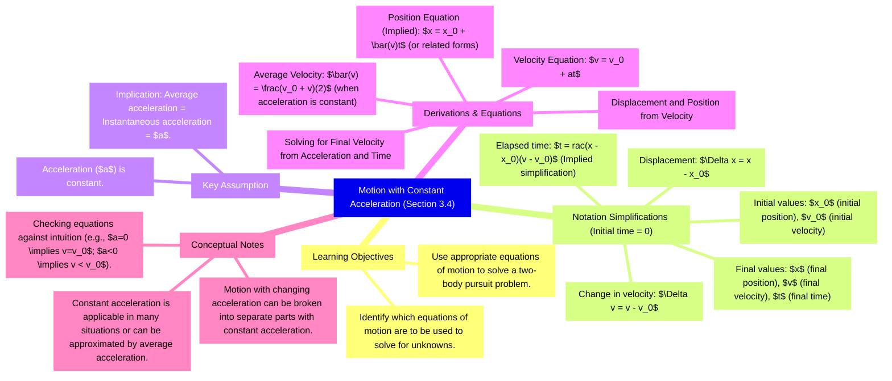
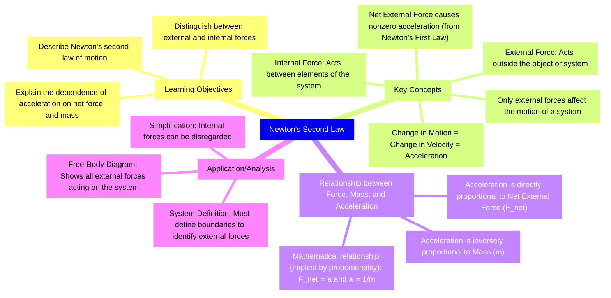
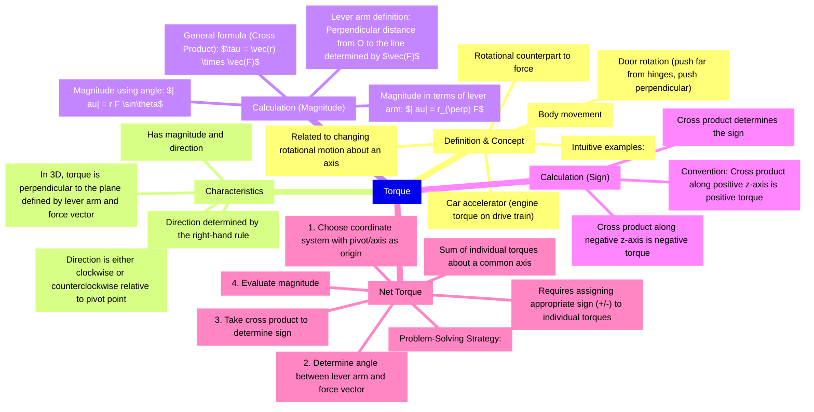
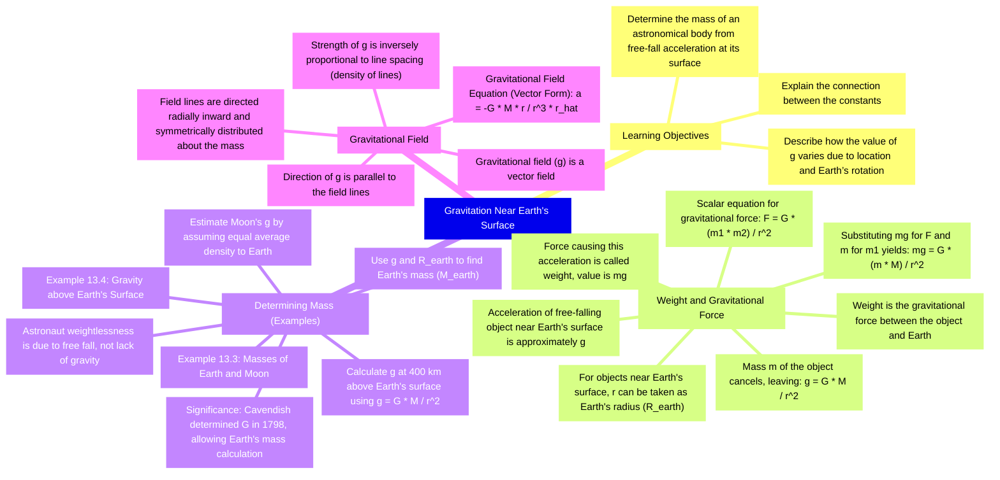
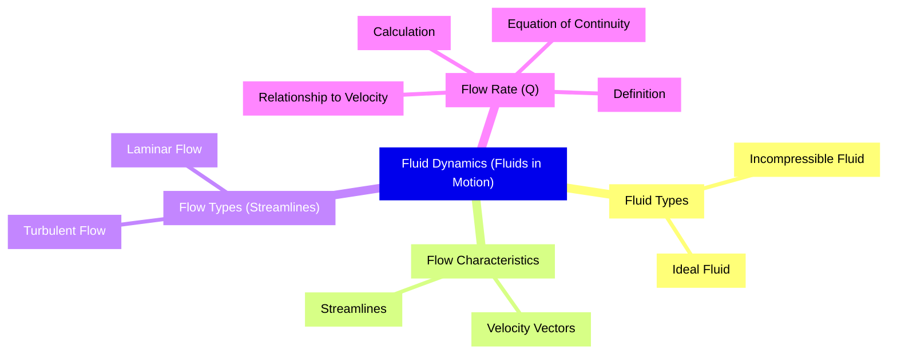

# 3.4 Motion with Constant Acceleration

*   **Simplifications in Notation:**
    *   Initial time is set to zero.
    *   Subscript **0** denotes initial values (e.g., $x_0$, $v_0$).
    *   No subscript denotes final values (e.g., $x$, $v$).
    *   Elapsed time is $t$.
    *   Displacement is $x$.
    *   Change in velocity is $v - v_0$.
*   **Constant Acceleration Assumption:**
    *   When acceleration ($\mathbf{a}$) is constant, the average acceleration equals the instantaneous acceleration.
    *   This allows the use of the symbol $\mathbf{a}$ for acceleration at all times, avoiding calculus.
    *   This assumption is valid for many situations or can be applied to separate parts of motion where acceleration changes drastically.
*   **Displacement and Position from Velocity:**
    *   Average velocity ($\bar{v}$) when acceleration is constant is the simple average of initial and final velocities: $\bar{v} = \frac{v_0 + v}{2}$.
    *   The equation relating displacement, initial velocity, time, and acceleration is: $x = x_0 + v_0 t + \frac{1}{2} a t^2$.
*   **Solving for Final Velocity from Acceleration and Time:**
    *   The equation derived from the definition of acceleration is: $v = v_0 + at$.
    *   **Significance:**
        *   Final velocity depends on the magnitude of acceleration and time.
        *   If $\mathbf{a} = 0$, then $v = v_0$ (constant velocity).
        *   If $\mathbf{a}$ is negative, the final velocity is less than the initial velocity.

**Key Terms:**
*   **Constant Acceleration**
*   **Initial Velocity** ($v_0$)
*   **Final Velocity** ($v$)
*   **Displacement** ($x$)

**Equations:**
*   $\bar{v} = \frac{v_0 + v}{2}$
*   $x = x_0 + v_0 t + \frac{1}{2} a t^2$
*   $v = v_0 + at$

---

# Section 5.3 Newton's Second Law

*   **Newton's second law** mathematically describes the cause-and-effect relationship between **force** and changes in motion.
*   It is a **quantitative** law used to calculate outcomes involving a force.
*   A **change in motion** is equivalent to a **change in velocity**, which means there is **acceleration**.
*   A **net external force** causes **nonzero acceleration**.
*   An **external force** acts on an object or system and originates outside of it.
*   An **internal force** acts between elements of the system.
*   Only **external forces** affect the motion of a system.
*   The relationship between acceleration and net external force is proportional: $a \propto F_{\text{net}}$.
*   The relationship between acceleration and mass is inversely proportional: $a \propto 1/m$.
*   Combining these proportionalities yields the equation for Newton's second law: $F_{\text{net}} = ma$.

**Key Terms:**
*   **External force**
*   **Internal force**
*   **Net external force** ($F_{\text{net}}$)
*   **Acceleration** ($a$)
*   **Mass** ($m$)

**Equations:**
*   $a \propto F_{\text{net}}$
*   $a \propto 1/m$
*   $F_{\text{net}} = ma$

---

# 6.2 Friction

*   **Friction** is a force that opposes relative motion between systems in contact.
*   Friction is a common yet complex force.
*   **Static friction** acts between objects that are stationary relative to one another.
*   **Kinetic friction** acts between objects that are moving relative to one another.
*   Static friction is usually greater than kinetic friction.
*   Static friction responds to applied force, increasing to be equal and opposite to the push up to a maximum limit.
*   Once the applied force exceeds the maximum static friction, the object moves, and kinetic friction takes over.
*   Friction arises partly due to the roughness of surfaces and partly due to **adhesive forces** between surface molecules.
*   At small but nonzero speeds, friction is nearly independent of speed.

**Key Terms:**
*   **Friction**: A force that opposes relative motion between systems in contact.
*   **Static friction**: Friction acting between stationary relative systems.
*   **Kinetic friction**: Friction acting between moving relative systems.
*   **Normal force** ($N$): The force exerted by a surface perpendicular to the object resting on it.
*   **Coefficient of static friction** ($\mu_s$): A measure related to the maximum static friction.
*   **Coefficient of kinetic friction** ($\mu_k$): A measure related to the kinetic friction.

**Equations:**
*   Maximum static friction: $f_{s, \text{max}} = \mu_s N$
*   Kinetic friction: $f_k = \mu_k N$

**Comparison of Static and Kinetic Friction**

| Type of Friction | Definition | When it Occurs | Relationship to Motion | Key Characteristic |
|---|---|---|---|---|
| Static Friction | Friction between two systems in contact and stationary relative to one another. | When objects are stationary. | Responds to applied force; increases to be equal and in the opposite direction of the push up to a maximum limit. | Usually greater than kinetic friction. |
| Kinetic Friction | Friction between two systems in contact and moving relative to one another. | When objects are moving relative to each other. | Once in motion, it is easier to keep it in motion than it was to get it started. | Less than static friction. |

---

# 10.6 Torque

*   **Torque** is the rotational counterpart to force, related to changing the rotational motion of an object about an axis.
*   Torque has both **magnitude** and **direction**.
*   In a plane, torque is either **clockwise** or **counterclockwise** relative to the chosen pivot point.
*   The magnitude of torque depends on the magnitude of the **lever arm** and the angle the force vector makes with the lever arm.
*   The **SI unit** of torque is **newtons times meters** ($\text{N}\cdot\text{m}$).
*   The **lever arm** is the perpendicular distance from the origin ($\text{O}$) to the line determined by the position vector ($\vec{r}$).
*   The magnitude of torque is given by the magnitude of the cross product: $|\vec{\tau}| = |\vec{r} \times \vec{F}| = r F \sin\theta$.
*   The torque is perpendicular to the plane defined by $\vec{r}$ and $\vec{F}$, and its direction is determined by the **right-hand rule**.
*   If the angle ($\theta$) between the position vector ($\vec{r}$) and the force vector ($\vec{F}$) is $0^\circ$ or $180^\circ$, the torque is zero.
*   The **net torque** about a fixed axis is the sum of the individual torques, using appropriate signs (positive or negative).

**Key Terms:**
*   **Torque**
*   **Lever arm**
*   **Net torque**
*   **Right-hand rule**

**Equations:**
*   $|\vec{\tau}| = |\vec{r} \times \vec{F}|$
*   $|\vec{\tau}| = r F \sin\theta$

---

# 13.2 Gravitation Near Earth's Surface

*   The acceleration of a free-falling object near Earth's surface is approximately $g$.
*   The force causing this acceleration is the **weight** of the object, with a value of $mg$.
*   This weight is the gravitational force between the object and Earth.
*   Substituting $mg$ for the magnitude of the gravitational force in Newton's law of universal gravitation yields the scalar equation:
    $$\frac{F}{m} = G \frac{M}{r^2}$$
*   For objects near Earth's surface, the mass $m$ of the object cancels, leaving:
    $$g = G \frac{M}{r^2}$$
*   The average radius of Earth is about $6370 \text{ km}$.
*   For objects within a few kilometers of Earth's surface, the distance between centers of mass can be taken as the radius of Earth, $r$.
*   The gravitational field ($\vec{g}$) is a **vector field** representing the gravitational acceleration caused by a mass $M$.
*   The vector form of the acceleration is:
    $$\vec{g} = -G \frac{M}{r^2} \hat{r}$$
*   The direction of $\vec{g}$ is parallel to the **field lines** at any point.
*   The strength of $\vec{g}$ is inversely proportional to the line spacing.

**Key Terms:**
*   **Weight**
*   **Gravitational force**
*   **Gravitational field** ($\vec{g}$)
*   **Field lines**

**Equations:**
*   $$g = G \frac{M}{r^2}$$
*   $$\vec{g} = -G \frac{M}{r^2} \hat{r}$$

---

# 14.5 Fluid Dynamics

*   **Fluid Dynamics** is the study of **fluids in motion**, contrasting with **fluid statics** (study of fluids at rest).
*   An **ideal fluid** has negligible **viscosity** (internal friction).
*   An **incompressible fluid** has a constant density throughout, requiring a large force to change its volume.
*   **Velocity vectors** represent fluid motion by indicating speed and direction at any point.
*   A **streamline** represents the path of a small volume of fluid; the velocity is always tangential to it.
*   **Laminar flow** is characterized by smooth, parallel streamlines (sometimes called steady flow).
*   **Turbulent flow** is characterized by irregular streamlines, mixing, and swirling, often occurring when fluid speed reaches a critical value.
*   **Flow rate ($Q$)**, or **volume flow rate**, is the volume of fluid passing a location through an area over a period of time.
    *   $Q = \frac{V}{t}$
*   The relationship between flow rate ($Q$) and average speed ($v$) is:
    *   $Q = A v$
    *   Flow rate is directly proportional to both the average speed and the cross-sectional area.
*   For an **incompressible fluid** with no sources or sinks, the mass flowing into a section must equal the mass flowing out.
*   The **equation of continuity** states that for any incompressible fluid:
    *   $A_1 v_1 = A_2 v_2$
    *   This implies that if the cross-sectional area ($A$) decreases, the velocity ($v$) must increase.

**Key Terms:**
*   **Fluid Dynamics**
*   **Viscosity**
*   **Incompressible fluid**
*   **Velocity vectors**
*   **Streamline**
*   **Laminar flow**
*   **Turbulent flow**
*   **Flow rate ($Q$)**
*   **Equation of continuity**

**Equations:**
*   $Q = \frac{V}{t}$
*   $Q = A v$
*   $A_1 v_1 = A_2 v_2$

